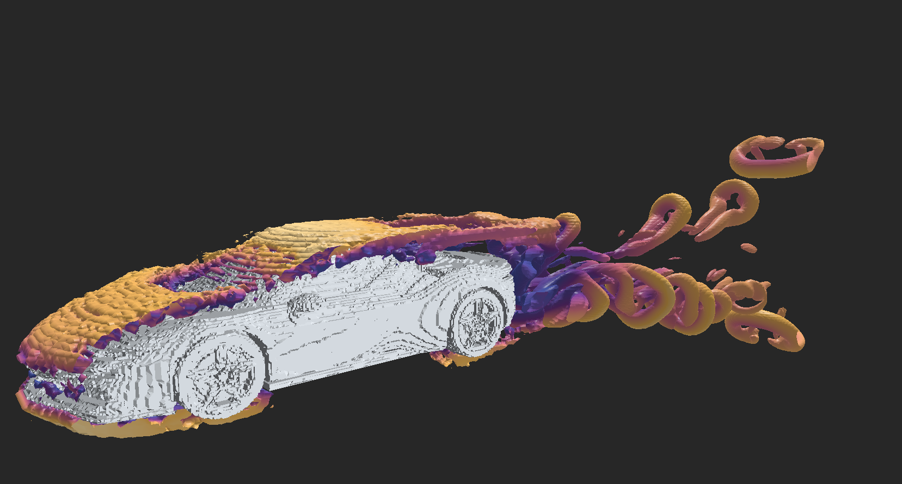

# RustFluid

RustFluid is a GPU lattice Boltzmann method (LBM) solver written in Rust with
`wgpu` compute shaders. It provides independent D2Q9 and D3Q19 solvers,
runtime-selectable collision and boundary components, headless diagnostics and
benchmarks, and an interactive 3D wind-tunnel renderer.

## Highlights

- D2Q9 and D3Q19 lattices with shader source assembled from Rust traits.
- BGK/SRT and MRT collision in 2D; BGK/SRT, MRT, TRT, and Smagorinsky LES in 3D.
- FP32 populations and FP16 storage with FP32 arithmetic (`FP16S`) when the
  adapter supports `SHADER_F16`.
- Fluid, halfway bounce-back, free-slip, equilibrium inlet, zero-gradient
  outlet, and left-face Zou-He velocity boundaries.
- Per-axis periodicity, three-axis body forcing, uniform or Taylor-Green
  initialization, and an optional high-X sponge layer.
- SVG rasterization for 2D obstacles and rotated, scaled STL voxelization for
  3D geometry. The STL loader also creates a welded display mesh.
- 3D mesh, domain/geometry wireframe, particle flow, ribbon streamline, and
  Q-criterion marching-cubes rendering with interactive clipping.
- GPU diagnostics for equilibrium preservation, AA-pattern parity, closed-box
  conservation, Taylor-Green decay, and outlet/sponge wake behavior.

## Gallery

<p align="center">
  
</p>

<p align="center">
  
</p>

<p align="center">
  
</p>

## Build and run

Requirements are a recent stable Rust toolchain and a GPU/driver supported by
`wgpu`.

```powershell
cargo check -p rust_fluid --all-targets
cargo test -p rust_fluid --lib
```

The default binary runs the headless FluidX3D cylinder case:

```powershell
cargo run --release -p rust_fluid --bin rust_fluid
```

The explicit benchmark binary runs the same entry point:

```powershell
cargo run --release -p rust_fluid --bin benchmark_3d
```

Run the diagnostic smoke suite with:

```powershell
cargo run --release -p rust_fluid --bin diagnose_3d -- --suite smoke
```

To launch the interactive STL wind tunnel, change `src/main.rs` to call
`examples::stl_windtunnel::run` and provide an STL path. The checked-in Ferrari
asset can be passed as `rust_fluid/assets/ferrari.stl`; omitting the path uses a
cylinder.

## FluidX3D comparison case

The headless case reproduces the FluidX3D cylinder layout in RustFluid's axis
ordering:

- Grid: `768 x 192 x 64` (9,437,184 cells).
- Solid cylinder: 205,376 cells; diameter 64 lattice units.
- Model: D3Q19 BGK with FP16 population storage and FP32 arithmetic.
- Design velocity: `0.577`; Reynolds number: `25,000`.
- Periodic boundaries on all axes and a constant streamwise body force.
- FluidX3D `(X, Y, Z)` maps to RustFluid `(Z, X, Y)` for reported probes.
- The default run auto-tunes workgroup dimensions, warms up for 1,000 steps,
  then records ten samples of 1,000 steps each.

The harness prints adapter and driver metadata, MLUPS, density extrema, total
mass and momentum, mean/RMS velocity, symmetry error, and named probe values.
MLUPS is calculated from all lattice cells:

```text
MLUPS = cells * timed_steps / elapsed_seconds / 1,000,000
```

The external FluidX3D reference result retained by this project is 1,365.17
MLUPS. Because performance depends on the adapter, driver, thermal state, and
selected workgroup, compare that value with the output of a fresh local run
rather than treating an old RustFluid measurement as fixed.

### Current measured comparison

The full harness was run on October 2, 2026 with the current source and the
following result:

| Solver | Hardware / backend | Workgroup | Median MLUPS | Relative throughput |
|---|---|---:|---:|---:|
| FluidX3D reference | RTX 3050 Laptop GPU | reference setup | 1,365.17 | 100.00% |
| RustFluid | RTX 3050 4GB Laptop GPU, Vulkan, NVIDIA 617.14 | `128x2x1` | 1,161.73 | 85.10% |

RustFluid's ten 1,000-step samples ranged from 1,160.61 to 1,162.07 MLUPS, so
the median is 14.90% below the retained FluidX3D reference. The workgroup
auto-tuning pass also selected `128x2x1`, where its short measurement reached
1,162.92 MLUPS. At the final step 11,000, all 9,231,808 fluid cells were
finite, no fluid cell had negative
density, mean density was 1.004858152, and mean streamwise RustFluid velocity
was 0.047689940. These values describe this exact run rather than a portable
performance guarantee.

### Headless modes

Environment variables select shorter or more diagnostic executions:

| Variable | Effect |
|---|---|
| `RUSTFLUID_QUICK_BENCH=1` | Run five 200-step timing samples after a short warmup. |
| `RUSTFLUID_QUICK_AUDIT=1` | Print initial and step-100 correctness data. |
| `RUSTFLUID_AUDIT=1` | Print correctness checkpoints through step 11,000. |
| `RUSTFLUID_BOX_AUDIT=1` | Run positive-, zero-, and negative-force periodic-box checks. |
| `RUSTFLUID_WGS=64x2x2` | Bypass tuning and use the specified 3D workgroup. |
| `RUSTFLUID_ZERO_FORCE=1` | Disable cylinder-case body forcing. |
| `RUSTFLUID_NO_INTERIOR_OPT=1` | Disable the marked all-fluid interior fast path. |

## Interactive controls

The default 3D renderer uses mouse drag to orbit, right-drag to pan, and the
wheel to zoom. Number keys toggle layers: `1` streamlines, `2` Q-criterion,
`3` particle flow, `4` wireframe, and `5` the STL mesh. Arrow keys change the
Q isovalue, brackets change the speed scale, `I`/`P` move the section plane,
`O` changes its axis, `L` flips its side, and Space pauses the simulation.

Set `RUSTFLUID_RENDER_MODE` to `q`, `streamlines`, `flow_streams`, `wireframe`,
or `boundaries` to choose the initial layer configuration.

## Project layout

```text
rust_fluid/src/
|-- sim/
|   |-- common/       Precision and GPU readback helpers
|   |-- d2/           D2Q9 solver, shader compiler, physics, and buffers
|   `-- d3/           D3Q19 solver, shader compiler, physics, and buffers
|-- runtime/          Windowed/headless execution and shared traits
|-- render/           2D views and 3D visualization pipelines
|-- setup/            Domain flags plus SVG/STL geometry loading
|-- diagnostics/      Reusable GPU validation cases and result reporting
|-- benchmark/        Timing statistics, workgroup sweeps, and CSV rows
|-- validation/       CPU-side field, mass, and stability comparisons
|-- examples/         Headless comparison and interactive STL tunnel
`-- bin/              benchmark_3d and diagnose_3d entry points
```

The solver owns GPU buffers and pipelines. A lattice supplies discrete
velocities and weights, a collision component supplies the local relaxation
WGSL, and boundary components supply flag-selected streaming behavior. The
shader compiler combines them with precision and configuration constants, so
simulation code does not branch through trait objects inside a GPU step.

See [architecture.md](rust_fluid/architecture.md),
[adding_a_lattice.md](rust_fluid/adding_a_lattice.md), and
[adding_a_collision_model.md](rust_fluid/adding_a_collision_model.md) for the
extension points and their current contracts.

## Numerical scope

The FluidX3D harness is a same-layout comparison and regression tool, not a
claim of bitwise identity. FP16 storage quantizes populations, GPU reductions
and execution order differ, and collision or boundary selections change the
physics. Use the diagnostic suite and the printed full-field statistics when
changing shaders, precision, boundaries, or workgroup dimensions.
