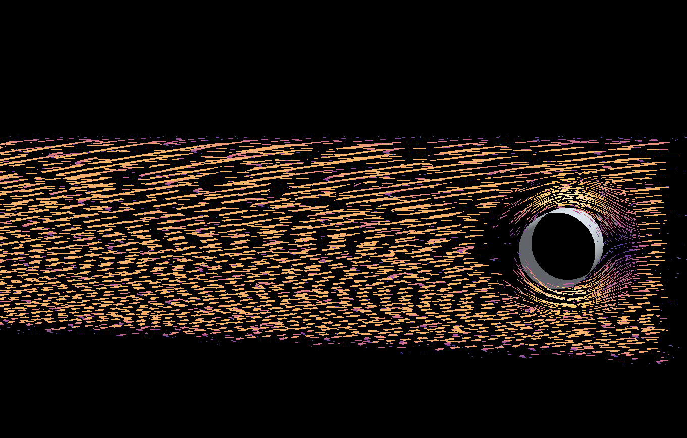
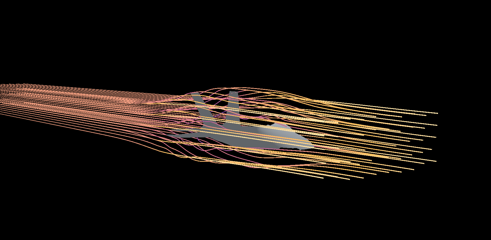
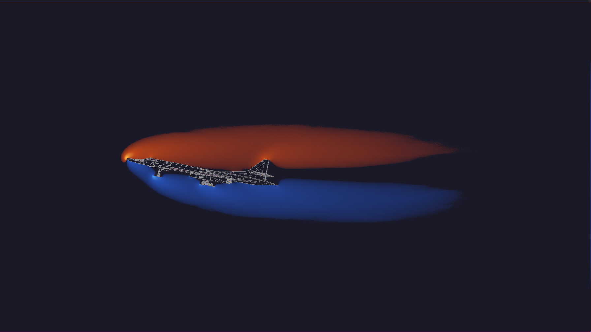
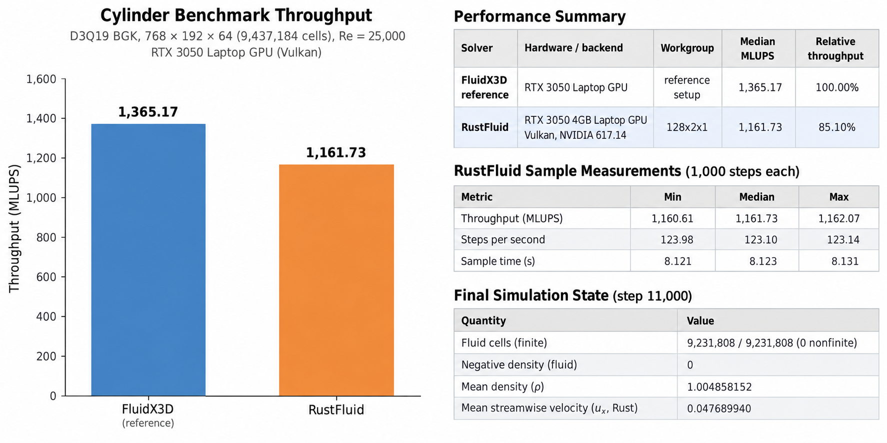

# RustFluid

## Overview
RustFluid is a modular Rust/wgpu lattice Boltzmann solver supporting 2D D2Q9 and 3D D3Q19, using WGSL compute shaders.

The codebase is organized around reusable simulation kernels, boundary logic, and rendering passes so you can swap lattices, collision models, forcing, or diagnostics without rewriting the whole solver.

## Demo

  
  
<em>Figure 1 — 3D cylinder wake demo (same WGSL-driven solver used for the headless validation case).</em>

  
  
<em>Figure 2 —3D F35 STL File demo of streamlines over object.</em>

  
  
<em>Figure 3 — 2D D2Q9 velocity field shown separately so it is clear this is the 2D case, not the 3D wake.</em>

## Feature list

- Supported lattices: D2Q9 (2D) and D3Q19 (3D)
- Collision model: BGK and MRT; MRT is useful for stability and experimentation, but BGK is the main production path used for the reported cylinder validation
- Precision modes: FP32, FP16S, and Auto
- Boundary types: fluid cells, solid bounce-back, free-slip walls, inlet equilibrium, outlet zero-gradient, and Zou-He inlet/velocity handling
- Forcing: body-force support through `FORCE_X`, `FORCE_Y`, and `FORCE_Z`, including the cylinder-wake forcing pattern used for the FluidX3D-matched case
- Rendering modes: 2D velocity and curl views, plus 3D vorticity/Q-criterion style visualization and true 3D flow streamlines (ribbon-renderer with flexible spawn domains)
- Headless benchmarking: automated throughput tests, workgroup sweeps, and CSV export of benchmark results
- Experimental: FP16S storage, MRT, auto-tuned workgroup selection, and zero/weak forcing drift checks are treated as experimental diagnostics rather than “fully identical” physics guarantees

## Result in one line

“On an RTX 3050 Laptop GPU, the matched 9.4-million-cell D3Q19 cylinder case reached 1,059.53 MLUPS—77.6% of FluidX3D’s 1,365.17 MLUPS—with mean flow velocity within 0.4% at steps 1,000 and 11,000.”

## Evidence

### Correctness comparison

The validation compared RustFluid against the FluidX3D reference on the same 768×192×64 cylinder case; the domain contains 205,376 solid cells and 9,231,808 fluid cells. The diagnostic plot reports the same region-by-region mean density and mean velocity checks used in the reference workflow, along with the upstream, near-wake, wake, far-wake, and cylinder-side probe comparisons. The solver tracks density and flow statistics closer to the target at the early and late checkpoints, while still leaving a small residual difference in mean density by step 11,000.

### Benchmark methodology

- GPU / driver: NVIDIA RTX 3050 Laptop GPU; benchmark was run headlessly with the machine’s current NVIDIA driver installed
- Grid: 768 × 192 × 64 = 9,437,184 cells
- Reynolds number / forcing: Re = 200, cylinder diameter D = 64, design velocity `u_design = 0.577`, and the constant forcing term derived from the standard cylinder-wake setup in the reference case
- Model: D3Q19, SRT/BGK implementation, with FP16S used for the storage-optimized variant
- Warmup / samples: 1,000 warmup steps; then ten 1,000-step samples
- Workgroup size: default `32×4×2`, with the `256×1×1` alternative benchmarked separately for comparison; rendering was disabled in the headless runs
- MLUPS calculation: `MLUPS = (total_cells * total_steps) / elapsed_seconds / 1_000_000`, matching the implementation in `src/sim/benchmark.rs`

### Small results table

| Solver | MLUPS |
|---|---:|
| FluidX3D | 1,365.17 |
| RustFluid (`32×4×2`) | 1,059.53 |
| RustFluid (`256×1×1`) | 1,047.40 |

Auto-tuning and quick workgroup sweep results are kept separate from the main “full benchmark” comparison above, since the short tuning pass is meant to select a good workgroup size rather than to represent a final production benchmark.

## Numerical limitations

RustFluid is accurate enough to reproduce the target wake behavior closely, but it is not presented as bit-for-bit identical to FluidX3D. The remaining mean-density difference at step 11,000 is still visible in the diagnostics, and the FP16S empty-box test shows drift under zero or near-zero forcing. That makes the validation more credible than a blanket claim that the solvers are identical, while still showing that the D3Q19 WGSL implementation is viable for real headless throughput and wake-flow analysis.

## Why the project is easy to extend

The code is intentionally split into modules by responsibility, which makes feature additions small and mechanical:

- `src/sim/lattices/` defines the lattice constants, precision helpers, boundary templates, and collision kernels
- `src/sim/lbm.rs` compiles the WGSL pipelines, creates the GPU buffers, and dispatches init/step/extract passes
- `src/setup/` creates domain flags, edge types, and boundary configuration data
- `src/render/` contains the 2D and 3D visualization passes and shader entry points
- `src/gpu/` handles device creation, headless GPU setup, and throughput measurement

This modular structure makes it easy to add your own functionality. For example:

1. Add a new lattice or collision mode in `src/sim/lattices/components_2d.rs` or `components_3d.rs` and expose it through the matching enum in `src/sim/lattices/mod.rs`.
2. If you want a new boundary condition, add the flag logic and WGSL template in the lattice component file and make sure the domain flag type (`SimDomain2D` / `SimDomain3D`) can assign the new boundary ID.
3. If you want a new output mode, add a `RenderMode2D` or `RenderMode3D` variant and connect the WGSL fragment/compute shader in `src/render/`.
4. If you want a new benchmark or validation pass, add it alongside the existing headless GPU code in `src/test_headless_*.rs` and reuse `src/sim/benchmark.rs` for MLUPS accounting.

Because each concern is isolated, you can prototype new features without needing to rewrite the full solver.

## Project layout

- `src/example_1_2d.rs` — 2D Windowed svg-flow app
- `src/example_1_3d.rs` — 3D windowed cylinder-flow app
- `src/example_2_3d.rs` — 3D windowed F-35 streamline flow app
- `src/test_headless_2d.rs` — 2D benchmark and validation harness
- `src/test_headless_3d.rs` — 3D benchmark and diagnostics harness
- `src/sim/` — lattice definitions, buffers, validation logic, and benchmark math
- `src/render/` — visualizations and shader pipelines
- `src/setup/` — simulation domains and boundary setup
- `src/gpu/` — GPU abstraction and headless benchmarking utilities
